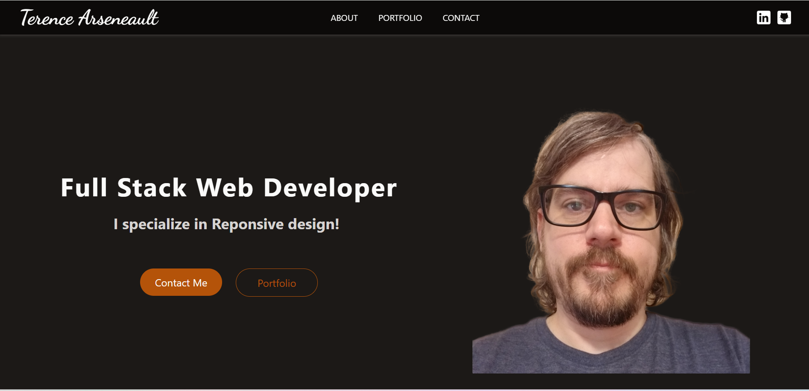
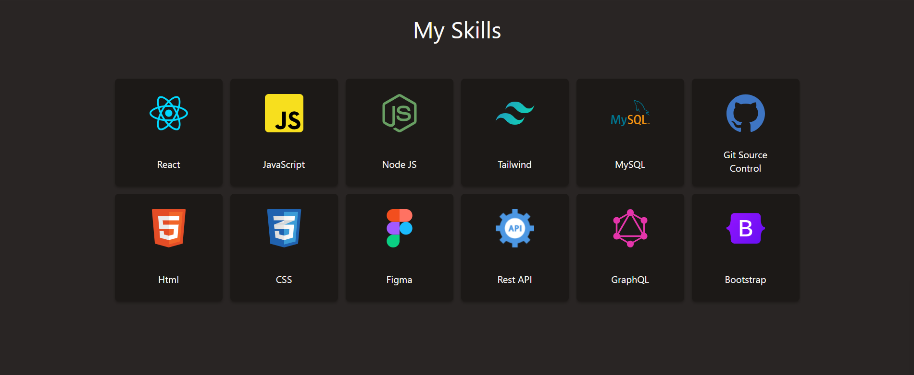

# Terence Arseneault - Full Stack Web Developer

Welcome to my professional portfolio! I'm Terence Arseneault, a dedicated and skilled full stack web developer based in Saint John, New Brunswick, Canada. With a solid foundation from the University of New Brunswick coding bootcamp, I am committed to crafting exceptional websites that are both responsive and user-friendly. My work philosophy revolves around embracing agile development methodologies to ensure efficient and high-quality project delivery.

## About Me

I'm a dedicated coding enthusiast who has transitioned from a captivating hobby to a thriving career in web development. My journey included honing my skills at The University of New Brunswick's Full Stack Coding Bootcamp, where I gained unwavering confidence in my abilities.

My work is characterized by meticulous attention to detail, resulting in clean, responsive code. I possess a versatile technical toolkit encompassing HTML, CSS, JavaScript, React.js, jQuery, Bootstrap, Git/Github, Node.JS, Express.JS, SQL, MySQL, Figma, EJS, Sequelize, Heroku, NoSQL, and MongoDB. I excel in problem-solving and thrive under pressure, with a strong reputation for my collaborative spirit.

Embracing new challenges, such as learning new languages or exploring fresh frameworks, is a constant pursuit that fuels my growth and passion for this dynamic field. Beyond coding, I'm a creative at heart. I immerse myself in 3D art using Blender and enjoy playing and recording music. I'm committed to leaving my mark in this ever-evolving world of technology.

Thanks for being part of this exciting journey!

## Skill Highlights

- **Full Stack Web Development**
  - Frontend: React, HTML, CSS, JavaScript, jQuery, Bootstrap, Tailwind, NextJS, Vite
  - Backend: Node.js, Express.js, MySQL, Netlify, GraphQL
- **Agile Methodologies**
- **Figma**
- **3D Art: Modeling, Sculpting, Animation**
- **Music Recording and Production**

## Screenshots

## Contact Me

I'm always open to collaboration, discussions, and inquiries. Let's connect and explore the possibilities:

- **Email:** [terence.arseneault@hotmail.com](mailto:terence.arseneault@hotmail.com)
- **GitHub:** [View My GitHub](https://github.com/Terence-A)
- **LinkedIn:** [View My LinkedIn](https://www.linkedin.com/in/terence-arseneault-90489b265/)
- **Deployed App:** [View My Portfolio](https://terencearseneaultportfolio.netlify.app)
- **Location:** Saint John, New Brunswick, Canada

Thank you for visiting my GitHub repository. Feel free to explore my projects and get in touch!
